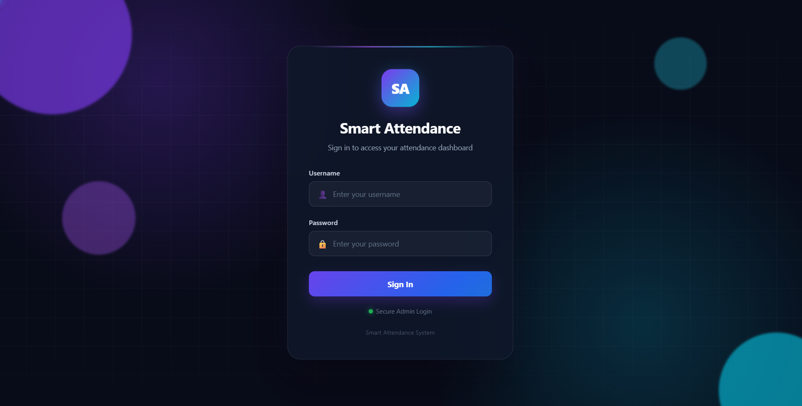
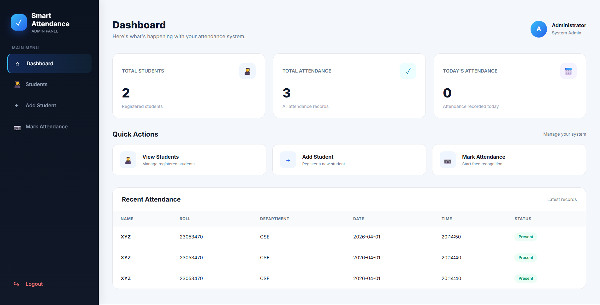
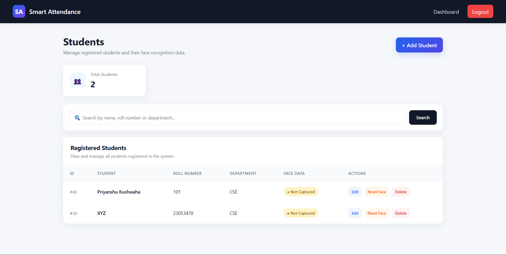
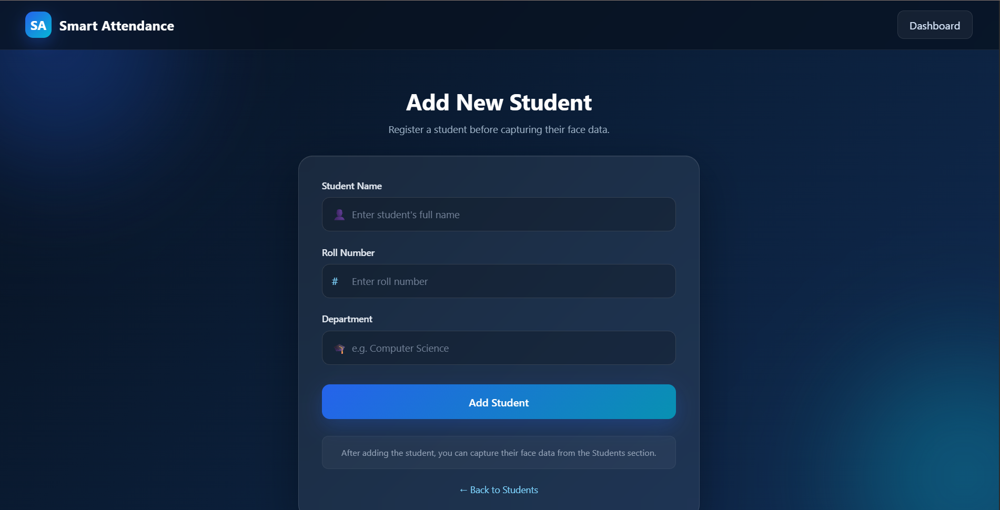
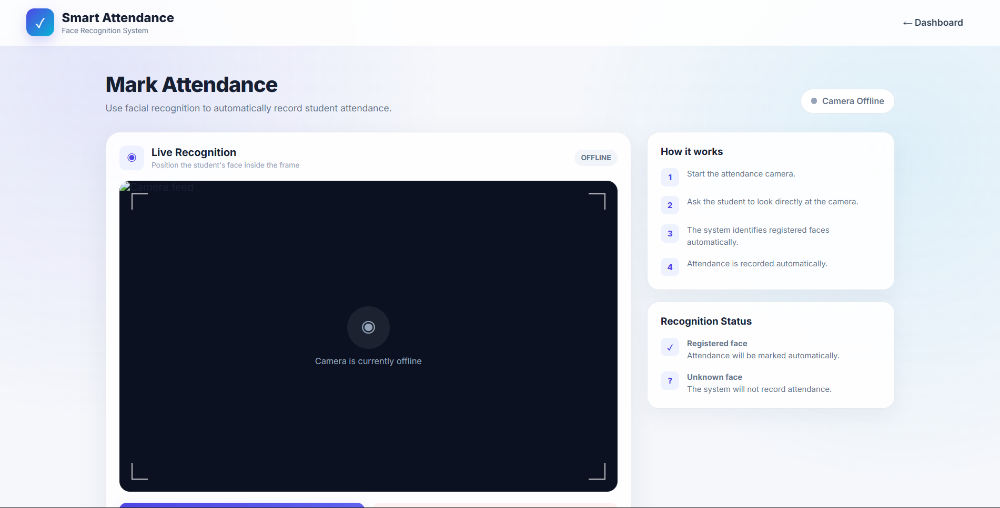
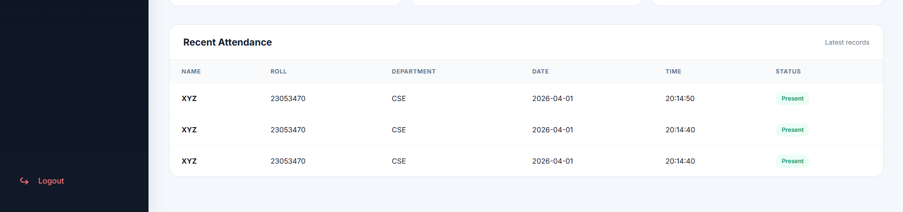

# 📸 Smart Attendance System

## 🚀 Live Demo

🔗 **[Try Smart Attendance System](https://smart-attendance-system-09qn.onrender.com)**

### Demo Login
- **Username:** demo
- **Password:** Demo@2026

> This is a portfolio demonstration. Camera-based face recognition requires local webcam access and is not available in the hosted demo.

A modern **Face Recognition-Based Smart Attendance System** built with **Python, Flask, OpenCV, and SQLite**.

The system allows an administrator to manage students, capture and train facial data, recognize students through a webcam, and automatically record their attendance in real time.

## 📸 Project Screenshots

### 🔐 Login Page

<p align="center">
  
</p>

### 📊 Dashboard

<p align="center">
  
</p>

### 👨‍🎓 Student Management

<p align="center">
  
</p>

### ➕ Add Student

<p align="center">
  
</p>


### 🟢 Mark Attendance

<p align="center">
  
</p>

### 📋 Attendance Records

<p align="center">
  
</p>

## 🚀 Features

### 🔐 Admin Authentication

* Secure admin login system
* Username and password authentication
* Login validation with success/error messages
* Protected dashboard and application routes
* Logout functionality

### 📊 Dashboard

* Total registered students
* Total attendance records
* Today's attendance count
* Recent attendance records
* Clean and responsive admin interface

### 👨‍🎓 Student Management

* Add new students
* View registered students
* Search students by:

  * Name
  * Roll number
  * Department
* Edit student information
* Delete students
* View face-data status

### 📷 Face Data Capture

* Webcam-based face capture
* Automatic face detection
* Capture multiple face samples
* Stores captured images for each student
* Option to reset old face data
* Visual capture progress

### 🧠 Face Recognition

* OpenCV Haar Cascade for face detection
* LBPH Face Recognizer for student identification
* Real-time webcam recognition
* Recognizes registered students
* Displays unknown faces separately

### 📝 Automatic Attendance

* Automatically marks recognized students as present
* Records:

  * Student name
  * Roll number
  * Department
  * Date
  * Time
  * Attendance status
* Cooldown mechanism prevents repeated attendance entries

### ✋ Manual Attendance

* Manually mark attendance for a registered student
* Useful when face recognition is temporarily unavailable

### 📋 Attendance Management

* View complete attendance history
* Search attendance records
* Filter attendance by date
* Filter by student information

### 📥 Export

* Export attendance records to CSV
* Download attendance data for further analysis

### 🎨 Modern UI

* Responsive interface
* Animated login page
* Modern dark-themed authentication screen
* Clean dashboard
* Responsive student and attendance pages
* Mobile-friendly layouts

---

## 🛠️ Technologies Used

| Technology   | Purpose                        |
| ------------ | ------------------------------ |
| Python       | Backend programming            |
| Flask        | Web framework                  |
| OpenCV       | Face detection and recognition |
| SQLite       | Database                       |
| HTML5        | Frontend structure             |
| CSS3         | Styling and animations         |
| JavaScript   | Frontend interactions          |
| Jinja2       | Flask template rendering       |
| Git & GitHub | Version control                |

---

## 📁 Project Structure

```text
Smart-Atendance/
│
├── app.py
├── database.py
├── train_model.py
├── requirements.txt
├── README.md
│
├── database/
│   └── attendance.db
│
├── dataset/
│   └── student-face-data/
│
├── trainer/
│   └── trainer.yml
│
├── exports/
│   └── attendance_export.csv
│
├── templates/
│   ├── login.html
│   ├── dashboard.html
│   ├── students.html
│   ├── add_student.html
│   ├── edit_student.html
│   ├── capture_face.html
│   ├── mark_attendance.html
│   └── attendance.html
│
├── static/
│   ├── css/
│   ├── js/
│   └── images/
│
└── haarcascade_frontalface_default.xml
```

> The exact folders/files may vary depending on your current project version.

---

# ⚙️ Installation

## 1. Clone the Repository

```bash
git clone https://github.com/YOUR-USERNAME/Smart-Atendance.git
```

Move into the project directory:

```bash
cd Smart-Atendance
```

---

## 2. Create a Virtual Environment

### Windows

```powershell
python -m venv .venv
```

Activate it:

```powershell
.venv\Scripts\Activate.ps1
```

If PowerShell blocks script execution, you can activate using:

```powershell
.venv\Scripts\activate
```

You should see:

```text
(.venv)
```

at the beginning of your terminal.

---

## 3. Install Dependencies

Install the required Python packages:

```bash
pip install -r requirements.txt
```

If you don't have a `requirements.txt` yet, the main dependencies include:

```bash
pip install flask opencv-contrib-python
```

---

# ▶️ Running the Application

After activating the virtual environment:

```bash
python app.py
```

You should see Flask start successfully.

Open your browser and visit:

```text
http://127.0.0.1:5000
```

The application will redirect you to the login page.

---

# 🔐 Login

The system requires administrator authentication.

Enter the admin credentials configured in your database.

After successful authentication:

```text
Login
  ↓
Dashboard
  ↓
Student Management
  ↓
Face Capture
  ↓
Model Training
  ↓
Face Recognition
  ↓
Attendance
```

---

# 👨‍🎓 Adding a Student

1. Login to the application.
2. Open **Students**.
3. Click **Add Student**.
4. Enter:

   * Student name
   * Roll number
   * Department
5. Submit the form.

The student will be added to the database.

---

# 📷 Capturing Face Data

After adding a student:

1. Open the **Students** page.
2. Select the student.
3. Choose **Capture Face**.
4. Start the webcam.
5. Look at the camera from different angles.
6. The system captures multiple face samples.
7. Once enough samples are collected, the face data is saved.

The captured images are stored inside the student's dataset folder.

---

# 🧠 Training the Face Recognition Model

After collecting face data, the system trains the recognition model.

The project uses:

```text
LBPH Face Recognizer
```

The trained model is stored as:

```text
trainer/trainer.yml
```

The model uses the captured student face images to recognize registered students.

---

# 📸 Marking Attendance

To mark attendance:

1. Open **Mark Attendance**.
2. Click **Start Camera**.
3. Allow camera access if requested.
4. Look at the webcam.
5. The system detects the face.
6. The trained model identifies the student.
7. Attendance is automatically recorded.

The system displays information such as:

```text
Student Name
Attendance Marked
```

Unknown faces are displayed as:

```text
Unknown
```

---

# ⏱️ Attendance Cooldown

A cooldown mechanism is implemented to prevent the same student from being repeatedly marked within a short period.

The current cooldown is:

```text
10 seconds
```

This helps prevent duplicate attendance entries while the webcam continuously recognizes the same face.

---

# 📋 Attendance Records

The Attendance section allows the administrator to:

* View attendance history
* Search records
* Filter by date
* View student details
* View attendance time
* View attendance status

---

# 📥 Export Attendance

Attendance data can be exported as a CSV file.

The exported file contains:

```text
ID
Student ID
Name
Roll
Department
Date
Time
Status
```

This allows the attendance data to be opened in applications such as Microsoft Excel or Google Sheets.

---

# 🗄️ Database

The application uses **SQLite** for storing application data.

The database contains information related to:

### Admin

```text
Username
Password
```

### Students

```text
ID
Name
Roll
Department
```

### Attendance

```text
ID
Student ID
Name
Roll
Department
Date
Time
Status
```

---

# 🔒 Security Notes

This project is primarily intended for educational and portfolio purposes.

Before deploying it to production, consider improving:

* Password hashing
* Secret key management
* CSRF protection
* Environment variables
* Input validation
* Database security
* Access control
* HTTPS
* Secure session configuration

For example, the Flask secret key should ideally be stored in an environment variable rather than directly inside `app.py`.

---

# 📷 Camera Requirements

The face recognition features require:

* Working webcam
* OpenCV
* `opencv-contrib-python`
* Haar Cascade XML file
* Captured face dataset
* Trained recognition model

Make sure the webcam is not being used by another application.

---

# 🐛 Troubleshooting

## OpenCV face module not found

If you receive an error related to:

```text
cv2.face
```

install the contrib version:

```bash
pip uninstall opencv-python
pip install opencv-contrib-python
```

Then restart the application.

---

## Camera not opening

Check that:

* Your webcam is connected.
* No other application is using it.
* Browser/camera permissions are enabled.
* OpenCV can access the default camera.

---

## Model not found

If attendance says:

```text
Train the model first.
```

capture face data and train the model before starting attendance recognition.

---

## TemplateNotFound Error

Make sure your HTML files are inside:

```text
templates/
```

For example:

```text
templates/login.html
templates/dashboard.html
templates/students.html
```

Flask automatically searches for templates inside the `templates` directory.

---

# 🔄 Application Workflow

```text
                 ┌──────────────┐
                 │    Login     │
                 └──────┬───────┘
                        │
                        ▼
                 ┌──────────────┐
                 │   Dashboard  │
                 └──────┬───────┘
                        │
             ┌──────────┴──────────┐
             ▼                     ▼
      ┌──────────────┐      ┌──────────────┐
      │   Students   │      │  Attendance  │
      └──────┬───────┘      └──────────────┘
             │
             ▼
      ┌──────────────┐
      │ Add Student  │
      └──────┬───────┘
             │
             ▼
      ┌──────────────┐
      │ Capture Face │
      └──────┬───────┘
             │
             ▼
      ┌──────────────┐
      │ Train Model  │
      └──────┬───────┘
             │
             ▼
      ┌──────────────┐
      │ Face         │
      │ Recognition  │
      └──────┬───────┘
             │
             ▼
      ┌──────────────┐
      │  Attendance  │
      │   Recorded   │
      └──────────────┘
```

---

# 🎯 Future Improvements

Possible future enhancements include:

* [ ] Password hashing with Werkzeug
* [ ] Admin profile management
* [ ] Multiple administrator accounts
* [ ] Student profile pages
* [ ] Attendance percentage calculation
* [ ] Monthly attendance reports
* [ ] Graphs and analytics
* [ ] Email notifications
* [ ] Late/early attendance detection
* [ ] Better face recognition accuracy
* [ ] Multiple camera support
* [ ] Cloud database integration
* [ ] REST API
* [ ] Role-based authentication
* [ ] Deployment using Docker
* [ ] Cloud deployment
* [ ] Improved mobile UI
* [ ] Advanced attendance analytics

---

# 📊 Project Highlights

This project demonstrates practical implementation of:

* Web application development
* Flask backend development
* Database management
* Computer vision
* Face detection
* Face recognition
* Real-time webcam processing
* CRUD operations
* Authentication
* AJAX/Fetch API
* CSV data export
* Responsive UI design

---

# 👨‍💻 Author

**Smart Attendance System**

Built as a practical Computer Science project combining **Web Development + Computer Vision + Database Management**.

---

# ⭐ Contributing

Contributions and improvements are welcome.

If you want to contribute:

```bash
git checkout -b feature/your-feature
```

Make your changes, then:

```bash
git add .
git commit -m "Add your feature"
git push origin feature/your-feature
```

Then create a Pull Request.

---

# 📄 License

This project is intended for educational and portfolio purposes.

You may modify and improve the project according to your requirements.
